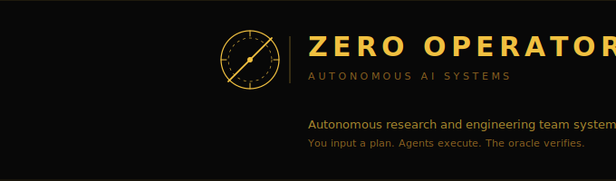

<div align="center">



<br/>
<br/>


<br/>
<br/>

**You input a plan. Agents execute. The oracle verifies.**

<br/>

[](#status)
[](#status)
[](#agent-teams)
[](#e2e-validation)

---

</div>

## What is this

Zero Operators (ZO) is an autonomous AI research and engineering team. You give it a project — a GitHub repo, some source documents, and success criteria — and it builds, trains, validates, and delivers. A coordinated team of AI agents handles the full ML lifecycle: data engineering, model building, oracle validation, code review, testing, and explainability.

You stay in the loop at human checkpoints. ZO remembers everything across sessions. It learns from its mistakes. And the delivery repo stays clean — zero ZO artifacts leak into your project.

---

## User Workflow

```
  You                          ZO                           Delivery Repo
  ───                          ──                           ─────────────

  1. Draft a plan ───────────► zo draft ──► plan.md
                                              │
  2. Review & edit plan  ◄─────────────────────┘
                                              │
  3. Launch ─────────────────► zo build plans/project.md
                                              │
                               ┌──────────────┘
                               │
                          Orchestrator
                          decomposes plan
                          into phases
                               │
                               ▼
                    ┌─── Agent Team (tmux) ───┐
                    │                         │
                    │  Data Engineer           │
                    │  Model Builder           │ ──────► src/
                    │  Oracle / QA             │ ──────► models/
                    │  Code Reviewer           │ ──────► reports/
                    │  Test Engineer            │ ──────► tests/
                    │                         │
                    │  Peer-to-peer comms      │
                    │  via SendMessage          │
                    └─────────┬───────────────┘
                              │
  4. Review at gates ◄────────┤  (supervised mode)
     Approve / iterate        │
                              │
  5. Session ends ───► STATE.md + DECISION_LOG + PRIORS
                              │
  6. Resume anytime ─► zo continue project
                              │
  7. Delivery ◄───────────────┘  Clean repo, zero ZO artifacts
```

**Step by step:**

1. **Draft a plan** — `zo draft --project my-project` opens an interactive Claude session that drafts a `plan.md` conversationally. Optionally provide source docs or a description (`-d`)
2. **Review the plan** — edit `plans/my-project.md` to sharpen the objective, set oracle thresholds, add domain knowledge
3. **Launch** — `zo build plans/my-project.md` shows a phase review (subtasks, agents, oracle criteria), prompts for additional instructions, then spawns the agent team in tmux
4. **Approve at gates** — in supervised mode (default), every phase transition pauses for your review. You can also type directly into the Lead Orchestrator's Claude Code session
5. **Session continuity** — stop anytime. Run `zo build` again — it auto-detects the current phase and resumes. Or use `zo continue my-project` as shorthand
6. **Self-evolution** — when something fails, ZO runs a post-mortem: fix the symptom, update the rule that allowed it, verify the rule prevents recurrence
7. **Clean delivery** — your project repo contains only code, models, reports, and tests. Zero ZO infrastructure

---

## Commands

### `zo build` — The primary command

```bash
zo build plans/my-project.md --gate-mode supervised
```

Smart mode detection:
- **Fresh project** (no state) — builds from scratch
- **Existing state** — continues from the current phase
- **Plan edited** since last run — re-decomposes and resumes

Shows a brand panel, phase review with subtasks/agents/oracle criteria, and prompts for additional instructions before launching.

### `zo continue` — Resume shorthand

```bash
zo continue my-project
```

Finds `plans/{project}.md` and runs `zo build` on it. Shorthand for when you don't want to type the plan path.

### `zo draft` — Draft a plan with scout team

```bash
zo draft -p my-project --docs ~/docs/ --data ~/data/    # docs + data inspection
zo draft -p cifar10 -d "CIFAR-10 CNN, PyTorch, 90%+"    # from description
zo draft -p my-project                                    # fully conversational
```

Launches a **Plan Architect** (Opus) that drafts `plan.md` conversationally with you. Optionally spawns **Data Scout** (inspects `--data` paths for schema, distributions, quality flags) and **Research Scout** (finds prior art and baselines) in the background. Scout findings are woven into the plan as they arrive. All args are optional — if nothing provided, the architect asks you everything conversationally.

### `zo init` — Scaffold a new project (conversational by default)

```bash
zo init my-project                                              # conversational (default)
zo init my-project --no-tmux --branch main --scaffold-delivery /path/to/delivery-repo
zo init ivl-f5    --no-tmux --branch samtukra --existing-repo ~/code/ivl-f5 --layout-mode adaptive
```

Default behaviour launches the **Init Architect** (Opus) in a tmux pane. The agent interviews you (new vs existing repo, branch, training host, data location, layout mode), inspects the target repo, runs `--dry-run` to preview the file tree, and only commits writes after you confirm. For CI/scripts, pass `--no-tmux` plus the flags you need.

Creates: `memory/{project}/`, `targets/{project}.target.md`, `plans/{project}.md` (with auto-populated `## Environment` section), and a delivery repo scaffold. With `--existing-repo`, adds only ZO infrastructure dirs (`configs/`, `experiments/`, `docker/`) without touching existing code. With `--layout-mode=adaptive`, preserves your code layout entirely. If you need to start over, `zo init {project} --reset` deletes the ZO artifacts (memory, target, plan) without ever touching the delivery repo. See [Delivery Repo Structure](docs/DELIVERY_STRUCTURE.md) and [`docs/COMMANDS.md`](docs/COMMANDS.md) for the full flag surface.

### `zo preflight` — Validate before launch

```bash
zo preflight plans/my-project.md --target-repo /path/to/delivery
```

Runs local-only validation: Claude CLI, tmux, plan parsing, agent definitions, memory round-trip, Docker, GPU availability. Fix failures before running `zo build`.

### `zo status` — Check current state

```bash
zo status my-project
```

Displays the current `STATE.md`: active phase, blockers, next steps, agent statuses.

### `zo watch-training` — Live training dashboard

```bash
zo watch-training --project my-project
```

Persistent Rich panel showing epoch progress, metrics table (current/best/target), loss sparkline, and checkpoint history. Auto-launched by `zo build` during Phase 4 via tmux split-pane — no window switching needed. Training scripts emit metrics via `ZOTrainingCallback` from `zo.training_metrics`.

---

## Gate Modes

Control how much autonomy ZO has at phase transitions.

| Mode | Flag | Behaviour |
|------|------|-----------|
| **Supervised** (default) | `--gate-mode supervised` | Every phase gate pauses for your approval. You review metrics, decisions, and artifacts before proceeding. |
| **Auto** | `--gate-mode auto` | Only gates marked `BLOCKING` in the plan require approval. Automated gates proceed if all subtasks pass. |
| **Full Auto** | `--gate-mode full-auto` | No human gates. ZO runs start to finish autonomously. Use when you trust the pipeline. |

You can switch modes at runtime — start supervised, watch the first few phases, then switch to auto once you trust the flow.

### `zo gates set` — Change gate mode mid-session

```bash
zo gates set auto --project my-project
zo gates set full-auto -p my-project
```

Writes the new mode to `memory/{project}/gate_mode`. The running orchestrator and wrapper pick it up on the next poll cycle — no restart needed.

### Live Status & Haiku Headlines

During `zo build`, the main terminal shows a live activity feed: tasks, agent progress, comms events. Every 60 seconds, Claude Haiku generates a 1-line headline summarising recent activity — like news ticker for your build.

---

## Quick Start

```bash
# 1. Clone and setup
git clone https://github.com/SamPlvs/zero-operators.git
cd zero-operators
./setup.sh                    # validates deps, auto-fixes missing ones interactively

# 2. Install
uv sync --extra dev

# 3. Initialize a project
zo init my-project

# 4. Option A: Draft a plan from source documents
zo draft ~/docs/requirements.md ~/data/ --project my-project

# 4. Option B: Write a plan manually
#    Edit plans/my-project.md — fill in all 8 sections

# 5. Start tmux (required for agent visibility)
tmux new -s zo

# 6. Launch — you'll see a phase review, then agents in tmux panes
zo build plans/my-project.md

# 7. Navigate tmux panes
#    Ctrl-b n     → switch to agent window
#    Ctrl-b p     → back to monitoring window
#    Ctrl-b q N   → jump to pane N
#    Ctrl-b z     → zoom current pane

# 8. Approve at human checkpoints (supervised mode)
# 9. Resume if interrupted
zo continue my-project

# 10. Check status anytime
zo status my-project
```

---

## Session Pickup

Starting a new Claude Code session? Use `/zo-dev` to get full context:

```
/zo-dev
```

This loads STATE.md, DECISION_LOG, PRIORS, presents a briefing of where you are, and asks what to work on. No need to explain context manually — ZO remembers everything.

Other session commands:
- `/memory/prime zo-platform` — detailed context briefing with semantic search
- `/memory/recall "query"` — search past decisions for a specific topic
- `/memory/session-summary` — wrap up the current session cleanly

---

## Slash Commands

ZO provides 24 slash commands for Claude Code. See [docs/COMMANDS.md](docs/COMMANDS.md) for the full reference.

| Category | Key Commands |
|----------|-------------|
| Platform | `/zo-dev` |
| Project | `/project/import`, `/project/connect`, `/project/plan`, `/project/launch` |
| Memory | `/memory/recall`, `/memory/prime`, `/memory/priors`, `/memory/session-summary` |
| Gates | `/gates/approve`, `/gates/reject`, `/gates/gates` |
| Observe | `/observe/watch`, `/observe/logs`, `/observe/decisions`, `/observe/history` |
| Document | `/document/code-docs`, `/document/model-card`, `/document/retrospective`, `/document/validation-report` |
| Agents | `/agents/agents`, `/agents/spawn`, `/agents/create-agent` |
| Utility | `/commit` |

---

## ML Workflow

ZO follows a structured pipeline defined in `specs/workflow.md`. Three modes available:

### Classical ML (default)

```
Phase 1: Data Review & Pipeline     → Gate (automated)
  13 subtasks covering schema validation, outlier detection, class imbalance, split strategy, and more

Phase 2: Feature Engineering        → Gate (BLOCKING — human approves features)
  Feature creation, statistical filtering, multicollinearity pruning

Phase 3: Model Design               → Gate (automated)
  Architecture selection, loss design, training strategy, oracle setup

Phase 4: Training & Iteration       → Gate (automated — oracle loop)
  Baseline training, iteration protocol, cross-validation, ensemble

Phase 5: Analysis & Validation      → Gate (BLOCKING — human approves model)
  SHAP/explainability, domain consistency, error analysis, significance testing

Phase 6: Packaging                  → Gate (automated)
  Inference pipeline, model card, validation report, drift detection, test suite
```

### Deep Learning

Same phases but: Phase 2 focuses on input representation and transfer learning. Phase 3 adds architecture search and gradient diagnostics. Phase 4 adds training diagnostics.

### Research

Adds **Phase 0: Literature Review** (prior art survey, baseline definition). Phase 5 expands with ablation studies and reproducibility verification. Phase 6 adds paper-ready figures.

---

## Architecture

```
┌─────────────────────────────────────────────────────────────┐
│  Layer 1: Python CLI                                        │
│                                                             │
│  zo build ──► plan.py ──► orchestrator.py ──► wrapper.py    │
│               parse &      decompose phases    launch ONE   │
│               validate     build lead prompt   claude session│
│               plan.md      generate contracts               │
│                                                             │
├─────────────────────────────────────────────────────────────┤
│  Layer 2: Claude Code Session                               │
│                                                             │
│  Lead Orchestrator (native agent team)                      │
│  ├── TeamCreate("project")                                  │
│  ├── Agent(name="data-engineer", team_name="project")       │
│  ├── Agent(name="model-builder", team_name="project")       │
│  ├── Agent(name="oracle-qa", team_name="project")           │
│  └── Agents communicate peer-to-peer via SendMessage        │
│                                                             │
│  The Lead knows all 20 agents and creates new ones on the   │
│  fly if the project needs expertise not in the roster.      │
│                                                             │
├─────────────────────────────────────────────────────────────┤
│  Layer 3: Persistence                                       │
│                                                             │
│  memory.py ──► STATE.md        (session checkpoint)         │
│                DECISION_LOG.md (audit trail)                │
│                PRIORS.md       (domain knowledge)           │
│  semantic.py ► index.db        (decision search)            │
│  comms.py ───► YYYY-MM-DD.jsonl (structured event logs)     │
│  evolution.py ► post-mortem → rule updates → verification   │
│                                                             │
├─────────────────────────────────────────────────────────────┤
│  Layer 4: Delivery Repo (clean)                             │
│                                                             │
│  src/ models/ reports/ tests/ — zero ZO artifacts           │
│  Isolation enforced via target.py zo_only_paths blocklist   │
│                                                             │
└─────────────────────────────────────────────────────────────┘
```

---

## Agent Teams

**Project Delivery Team** — 11 agents that execute ML/research projects:

| Agent | Model | When Active | What They Do |
|-------|-------|-------------|-------------|
| Lead Orchestrator | Opus | Always | Creates team, decomposes phases, manages gates, coordinates |
| Research Scout | Opus | All phases | Literature survey, SOTA, open-source code, experiment plan |
| Data Engineer | Sonnet | Phases 1-2 | Data pipeline, cleaning, EDA, DataLoaders |
| Model Builder | Opus | Phases 3-5 | Architecture selection, training, iteration |
| Oracle / QA | Sonnet | Phases 3-5 | Hard metric evaluation, pass/fail gating |
| Code Reviewer | Sonnet | All phases | Code quality, PEP8, security, conventions |
| Test Engineer | Sonnet | All phases | Unit, integration, regression tests |
| XAI Agent | Sonnet | Phase 5 | SHAP, feature importance, explainability |
| Domain Evaluator | Opus | Phase 5 | Domain validation, plausibility checks |
| ML Engineer | Sonnet | Phases 4-6 | Inference optimization, experiment tracking |
| Infra Engineer | Haiku | Phases 1, 6 | Environment setup, packaging, deployment |
| Plan Architect | Opus | zo draft | Leads plan drafting, spawns scouts, converses with human |
| Data Scout | Sonnet | zo draft | Quick data inspection — schema, distributions, quality flags |

Code Reviewer and Research Scout are cross-cutting agents present in all phases by default.

**Dynamic agents** — if your project needs expertise not covered (NLP, time-series, security), the Lead Orchestrator creates a new agent definition on the fly.

---

## Self-Evolution

When something fails, ZO doesn't just fix the symptom:

```
Error detected
    │
    ▼
Step 1: Document failure ──► DECISION_LOG
Step 2: Root cause analysis ──► missing_rule? incomplete_rule? regression?
Step 3: Fix the immediate problem
Step 4: Update the rule ──► PRIORS.md / spec file / agent definition
Step 5: Verify the update would have caught the original failure
```

Over time, `PRIORS.md` accumulates domain knowledge. The same mistake never happens twice.

---

## Repository Structure

```
zero-operators/
├── src/zo/                     # Platform code (10 modules)
│   ├── cli.py                  # CLI: zo build/continue/init/status/draft/gates
│   ├── draft.py                # Conversational plan generation (with or without source docs)
│   ├── plan.py                 # Plan parser and validator (8 sections)
│   ├── target.py               # Target file parser, isolation enforcer
│   ├── orchestrator.py         # Phase decomposition, gate management, lead prompt
│   ├── wrapper.py              # Claude CLI launcher + team observer
│   ├── memory.py               # STATE.md, DECISION_LOG, PRIORS, sessions
│   ├── semantic.py             # fastembed + SQLite semantic search
│   ├── comms.py                # JSONL event logger (5 event types)
│   └── evolution.py            # Self-evolving post-mortem protocol
├── .claude/agents/             # 20 agent definitions
├── specs/                      # 8 specification documents
├── plans/                      # Project plan files
├── memory/                     # Per-project state (STATE.md, DECISION_LOG, PRIORS)
├── logs/                       # JSONL audit trails
├── targets/                    # Delivery repo configuration
├── tests/                      # 415 tests (unit + integration)
├── setup.sh                    # Environment validation (10 checks)
└── pyproject.toml              # Python package config
```

---

## E2E Validation

ZO has been validated end-to-end with an MNIST digit classification project.

**The agent team autonomously:**
- Built a data pipeline with DataLoaders and 32 data tests
- Designed a CNN (2 conv + BN + 2 FC layers)
- Trained to **99.00% test accuracy** (oracle threshold: 95%)
- Produced GradCAM visualizations, ablation study, significance testing
- Delivered 98 passing tests in the clean delivery repo
- Zero ZO artifacts leaked — 4 clean git commits

**Total cost:** ~$11 across all sessions.

```
mnist-delivery/          ← delivery repo (clean)
├── src/
│   ├── model.py         ← CNN architecture
│   ├── train.py         ← training loop
│   ├── inference.py     ← prediction pipeline
│   └── data_loader.py   ← MNIST DataLoader
├── models/best_model.pt ← trained checkpoint (99% accuracy)
├── oracle/eval.py       ← oracle evaluation script
├── xai/gradcam.py       ← GradCAM visualizations
├── experiments/         ← ablation, significance, reproducibility
├── tests/               ← 98 tests passing
└── pyproject.toml
```

---

## Status

**v1.0.1 — All phases complete. Validated end-to-end. Pre-IVL F5 hardening done.**

| Phase | What | Status |
|-------|------|--------|
| 0 | Agent definitions (17) + Claude Code setup | Done |
| 1 | Plan parser, target parser, comms logger, setup | Done |
| 2 | Memory layer, semantic index | Done |
| 3 | Orchestration engine + lifecycle wrapper | Done |
| 4 | Evolution engine, CLI, integration tests | Done |
| 5 | E2E validation (MNIST: 99% accuracy) | Done |
| 1.0.1 | Interactive tmux, brand panel, smart build, Research Scout, self-evolution | Done |
| pre-F5 | Phase persistence, auto-notebooks, delivery scaffold + Docker, preflight | Done |

453 platform tests. ruff clean. 20 agents. 24 slash commands.

---

<div align="center">
<br/>


<br/>
<br/>

`ZERO OPERATORS` · `v1.0.1` · `validated` · `99% MNIST accuracy`

<br/>
</div>
